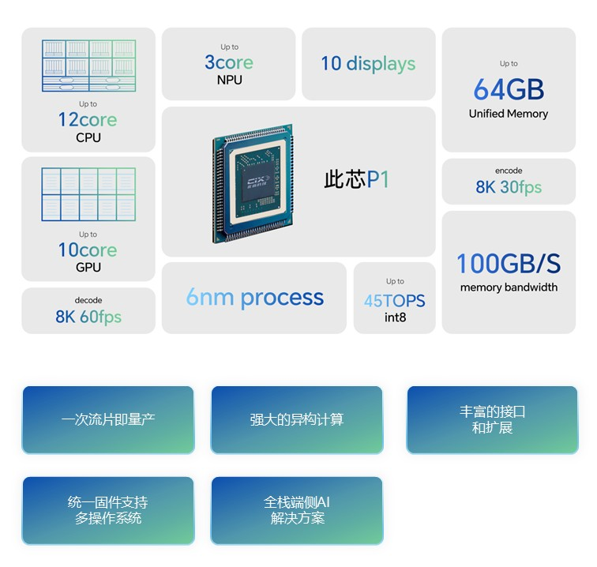

# 此芯P1简介

此芯科技核心产品此芯P1，是公司推出的首款SoC芯片。P1采用先进的6nm制程工艺，集成了12核Armv9.2 CPU、10核Immortalis G720 GPU以及30TOPS算力NPU，综合算力达45TOPS。公司基于“一芯多用”的发展战略，在AIPC、个人计算、智能座舱等端侧应用场景，实现了SBC、Laptop、Mini PC、边缘侧服务器、一体机等丰富的产品形态，产品最大支持64GB共享内存，提供高带宽IO，可为端侧AI应用场景提供高能效硬件支撑的解决方案。

## 此芯P1技术参数

